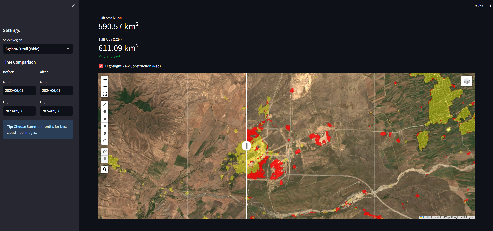

# 🛰️ Satellite Urban Reconstruction Monitor

A geospatial data science tool designed to quantity and visualize post-conflict urban development **anywhere in the world**.

While this project currently uses the **Karabakh region (Agdam/Fuzuli)** as a primary case study to demonstrate its capabilities, the code is modular and can be adapted to monitor reconstruction or urbanization in any geographic Region of Interest (ROI).


*(Screenshot demonstrating analysis on Fuzuli City)*

## 📊 How it Works
The application processes Sentinel-2 satellite imagery and applies the **Google Dynamic World** AI model to detect built-up surface materials (concrete, asphalt, buildings).

### Visualization Guide (The Map)
When using the interactive dashboard, the split-map shows:
*   🟡 **Yellow Overlay**: Infrastructure that already existed in the baseline year (e.g., 2020).
*   🔴 **Red Overlay**: **New Construction** detected in the comparison year (e.g., 2024).
*   **Slider**: Drag the slider left/right to compare the "Before" and "After" views.

## 🛠️ Tech Stack
*   **Python 3.9+**
*   **Google Earth Engine (GEE)**: Processing 50+ petabytes of satellite data in the cloud.
*   **Streamlit**: For the interactive web interface.
*   **Geemap**: For map rendering and layer management.

## 🚀 How to Run Locally

### 1. Prerequisites
*   Python installed.
*   A Google Earth Engine account.

### 2. Installation
```bash
git clone https://github.com/elvinvaliyev/karabakh-monitor.git
cd karabakh-monitor
pip install -r requirements.txt
```

### 3. Authentication
The first time you run the app, you need to authenticate with Google:
```bash
earthengine authenticate
```

### 4. Run the App
**Web Interface (Recommended):**
```bash
streamlit run app.py
```

**Command Line Mode (Headless):**
```bash
python cli_analysis.py
```

## ☁️ Deployment (Google Cloud)
This project includes a `Dockerfile` for deployment to Google Cloud Run.

1.  **Build**: `gcloud builds submit --tag gcr.io/YOUR_PROJECT_ID/karabakh-monitor .`
2.  **Deploy**: `gcloud run deploy --image gcr.io/YOUR_PROJECT_ID/karabakh-monitor --platform managed`

## 📈 Case Study: Karabakh
This repository includes a default configuration for monitoring the Agdam and Fuzuli regions of Azerbaijan.
*   **Rapid Growth**: Significant increase in built-up area observed in Agdam and Fuzuli sectors starting from 2021.
*   **Road Networks**: Integration of new major highways is clearly visible in the 2023-2024 timeframe.
